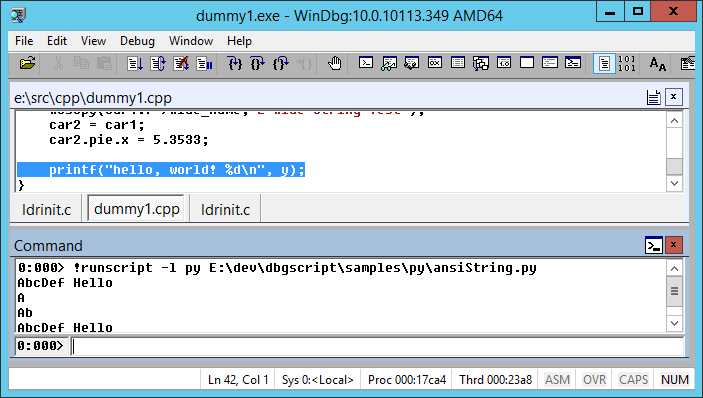

Tutorial
********

This section covers basic command invocation as well as a tutorial on writing a
simple script in the :doc:`Python`.

Basics
======

This section explains some basic usage of DbgScript. For details see the :doc:`Reference`.

Running Scripts
---------------

To run a script, use the ``!runscript`` entry point. For example::

    !runscript -l rb E:\dev\dbgscript\samples\rb\stack_test.rb

You can use `!scriptpath`_ to shorten the path you need to pass to ``!runscript``.

                
Ad-hoc Evaluation
-----------------

``!evalstring`` can be used to evaluate an ad-hoc statement. For example::

    0:031> !evalstring -l rb puts DbgScript.get_threads
    #<DbgScript::Thread:0x000045f764b788>
    #<DbgScript::Thread:0x000045f764b760>
    ...

This example evaluates the statement ``puts DbgScript.get_threads`` in the Ruby
script provider. The output is shown in the debugger (in this case, an array
of Thread objects.)

Other Entry Points
------------------

!scriptpath
^^^^^^^^^^^

This takes a comma-separated list of paths to search when running scripts. For example::

    !scriptpath e:\dev\rb_scripts,d:\pythonscripts
    
Note that the separator is a `comma`, not semicolon. Semicolon is reserved
by the debugger to separate commands.

Run with no arguments to see the current path list.

Example
=======

The following example demonstrates a simple program along with a sample script
to introspect its contents using the :doc:`Python`. The script is simple to port
to other languages like Ruby or Lua.

Suppose we have a simple C++ program:

.. literalinclude:: ../samples/cpp/dummy1.cpp
	:language: cpp
	:linenos:

If we run it in a debugger until the ``printf`` line (42), we can start to 
inspect the various objects we've created and populated.

For example, we can read the string in ``car1.f->name`` in various ways:

.. literalinclude:: ../samples/py/ansiString.py
	:linenos:
	
This example showcases :py:meth:`dbgscript.create_typed_object` to create a
:py:class:`dbgscript.TypedObject` from an address and type directly. This is a 
common way of bootstrapping a script (though normally, the address would be 
passed as a command-line argument to the script.) If the root object is a global,
it may be obtained with :py:meth:`dbgscript.get_global`.

This example also shows field lookup using the explicit ``obj['field']`` syntax.
Fields may also be looked up though `dynamic property` syntax, i.e. 
``obj.field``. In this case though, the explicit syntax must be used because
the field being looked up has the same name as, and thus would be otherwise 
hidden by the built-in property :py:attr:`dbgscript.TypedObject.name`. Built-in 
properties/methods take precedence.

Lastly, we read the string from the `TypedObject` wrapping the ``name`` field
with :py:meth:`dbgscript.TypedObject.read_string`. This yields a Python `str` 
ready to be printed out as usual.

Notice that `stdout` is redirected to the debugger's command window, as 
expected.